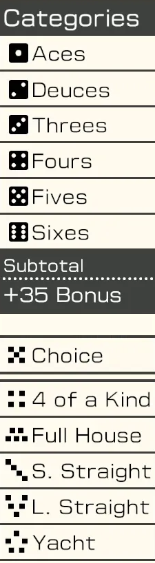

# Yacht-Agent

Yacht-Agent is a game agent based on Reinforcement Learning. It implements the Yacht game environment and designs/trains an agent that interacts with the environment. This repository focuses on studying Reinforcement Learning by training a Yacht agent.

Yacht is suitable for Reinforcement Learning due to its probabilistic nature involving dice and a clear scoring system. Additionally, its popularity, evidenced by many streamers playing it, makes it a great subject for RL study. The rules of Yacht are as follows.

## About Yacht

The Yacht game in this Yacht-Agent follows the rules of Nintendo's [Clubhouse Games: 51 Worldwide Classics](https://www.nintendo.com/us/store/products/clubhouse-games-51-worldwide-classics-switch/?srsltid=AfmBOopXvCoaovOKlagvIFdAEgXZ6Ygi-oj02CBmKv3mfdlKuLE5hAeU). Below is a brief description.

1. The object of the game is to score points by rolling five dice to make certain combinations.
2. The dice can be rolled up to three times in a turn to try to make these combinations.
3. After each round the player chooses which scoring category is to be used for that round.
4. Once a category has been used in the game, it cannot be used again.
5. The winner is the player who scores the most points.

### Yacht Scoring
<table>
    <tr>
        <td valign="top" width="30%">
            
        </td>
        <td valign="top">
            <table>
                <thead>
                    <tr>
                        <th>Category</th>
                        <th>Condition</th>
                        <th>Score</th>
                    </tr>
                </thead>
                <tbody>
                    <tr>
                        <td><strong>Aces</strong></td>
                        <td>Any combination</td>
                        <td>Sum of dice with number 1</td>
                    </tr>
                    <tr>
                        <td><strong>Deuces</strong></td>
                        <td>Any combination</td>
                        <td>Sum of dice with number 2</td>
                    </tr>
                    <tr>
                        <td><strong>Threes</strong></td>
                        <td>Any combination</td>
                        <td>Sum of dice with number 3</td>
                    </tr>
                    <tr>
                        <td><strong>Fours</strong></td>
                        <td>Any combination</td>
                        <td>Sum of dice with number 4</td>
                    </tr>
                    <tr>
                        <td><strong>Fives</strong></td>
                        <td>Any combination</td>
                        <td>Sum of dice with number 5</td>
                    </tr>
                    <tr>
                        <td><strong>Sixes</strong></td>
                        <td>Any combination</td>
                        <td>Sum of dice with number 6</td>
                    </tr>
                    <tr>
                        <td><em>(Bonus)</em></td>
                        <td><em>Score of Aces...Sixes >= 63</em></td>
                        <td><em>+35 points</em></td>
                    </tr>
                    <tr>
                        <td><strong>Choice</strong></td>
                        <td>Any combination</td>
                        <td>Sum of all dice</td>
                    </tr>
                    <tr>
                        <td><strong>4 of a Kind</strong></td>
                        <td>At least 4 dice the same</td>
                        <td>Sum of all dice</td>
                    </tr>
                    <tr>
                        <td><strong>Full House</strong></td>
                        <td>3 of one number, 2 of another</td>
                        <td>Sum of all dice</td>
                    </tr>
                    <tr>
                        <td><strong>S. Straight</strong></td>
                        <td>4 sequential dice</td>
                        <td>15 points</td>
                    </tr>
                    <tr>
                        <td><strong>L. Straight</strong></td>
                        <td>5 sequential dice</td>
                        <td>30 points</td>
                    </tr>
                    <tr>
                        <td><strong>Yacht</strong></td>
                        <td>All 5 dice the same</td>
                        <td>50 points</td>
                    </tr>
                </tbody>
            </table>
        </td>
    </tr>
</table>

## Dev Logs
1. [Yacht Game Environment](dev_logs/01_yacht_game_environment.md)
