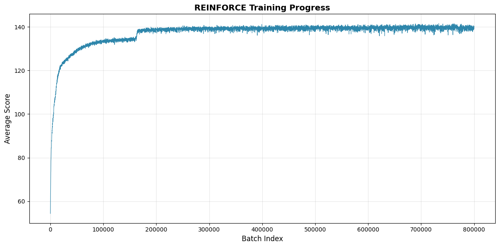

# Yacht Agent: REINFORCE

**Source Code**: [`yacht/yacht_reinforce.py`](../yacht/yacht_reinforce.py)

### 1. REINFORCE

- The simplest policy-based reinforcement learning algorithm.
- Plan to train with REINFORCE first, then extend to Actor-Critic family based on performance.

### 2. Model Architecture

- Input: Gymnax Observation space -> 19 dimensions
- Hidden1: 128 units, Leaky ReLU
- Hidden2: 64 units, Leaky ReLU
- Hidden3: 64 units, Leaky ReLU
- Output: Action space -> 44 dimensions

### 3. JAX Code

- Designed the algorithm and then commanded Gemini3 to 'do it'.
- Why JAX?
  - JAX: Compared to the familiar PyTorch, documentation is scarcer and debugging is harder.
  - In standard Gymnasium environments, playing one game takes too long.
  - Training on limited PC hardware (RTX 4070TI) takes too long with PyTorch (most time spent on game sampling).
  - In contrast, JAX allows for much faster sampling.
  - (Actually the biggest reason) JAX looks cool!!
  - Conclusion: Running RL algorithms implemented in JAX within Gymnax environments is the most efficient.

### 4. Action Masking

- Invalid actions (e.g., recording a score in an already filled slot) -> -100 Score.
- If invalid actions are allowed, the agent receives -100 scores for most attempts, making learning nearly impossible.
- Therefore, Action Masking is applied to set the probability of selecting invalid actions to 0.

### 5. Model Checkpoint

- Using `flax.training.checkpoints` module.
- Save the model every certain number of episodes.
- Plan to eventually upload the model to Huggingface!

### 6. Using Baseline

- Observed a phenomenon where loss decreases as training progresses, but score does not improve.
- Since all scores are currently positive, loss decreases as certain policies become more 'entrenched' (higher confidence).
- Applied baseline by subtracting the batch mean from scores to distinguish +/- within each batch.

### 7. Training Process and Termination
- Batch size: 10000 (number of games per batch)
- Number of batches: 800000 (total batches) -> 3h (with RTX 4070TI)
- Learning rate: 1e-3
- After reaching 800000 batches, score plateaued at 140 points -> Training terminated

- A sharp increase was observed around 180k batches -> presumably when the agent started successfully achieving the 'bonus' in the upper score section
- Planning to compare how quickly this 'bonus point' milestone is reached when evaluating different training methods / model architectures in the future!